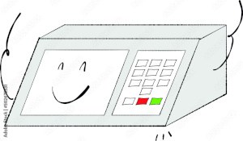
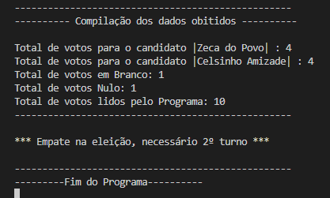
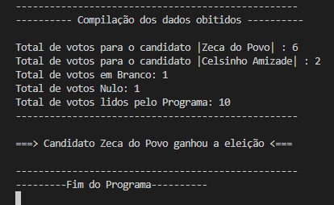
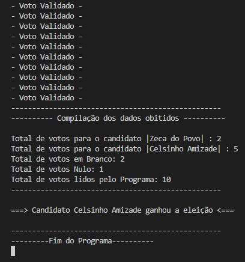

  

## Código - Urna Eletrônica 📊

### Linguagem de Programação - C# 

Sistema de contagem de votos similar ao de uma urna eletrônica, o código foi desenvolvido utilizando a linguagem de programação <strong>C#</strong>. Programa proposto como atividade na faculdade.

- [x] Elaboração de um programa para representar o sistema de contagem de votos eleitorais, similar ao de uma <strong>Urna Eletrônica</strong>
- [x] Neste programa se tem dois candidatos e o usuário pode votar em um deles, nulo ou em branco

  
## Compilação 👨🏽‍💻

### Preview - Layout de voto 🗳

  

### Preview - Empate 🤷🏽‍♂️

  

## Preview - Vencedor 01 👨🏽‍🦳

  

## Preview - Vencedor 02 🧔🏽

  

## Tecnologias 🛠

- DotNet
- C# 

## Autor 🎨

- <a target="_blank" href="https://www.linkedin.com/in/ramon-barreto-076191180/">Ramon Barreto</a>

## Contato 📲

- Email: ramon_barreto_medrado@hotmail.com

